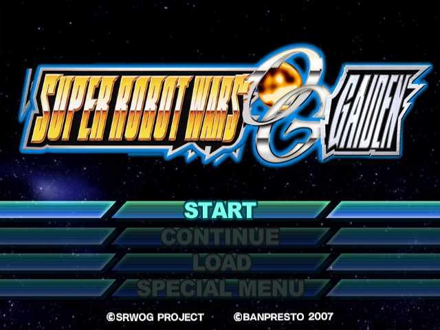
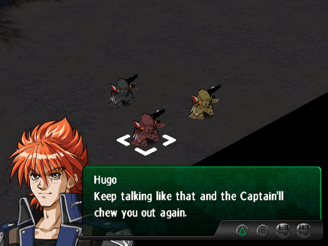
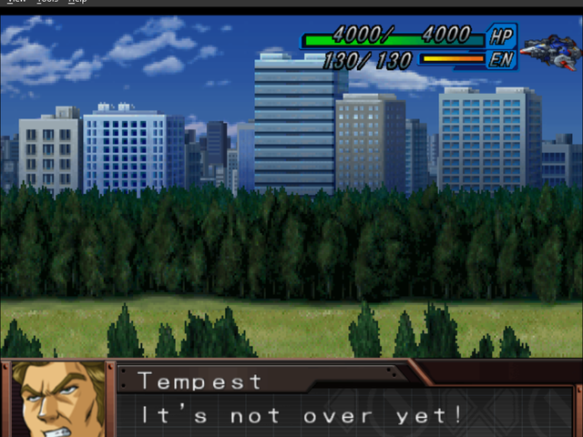
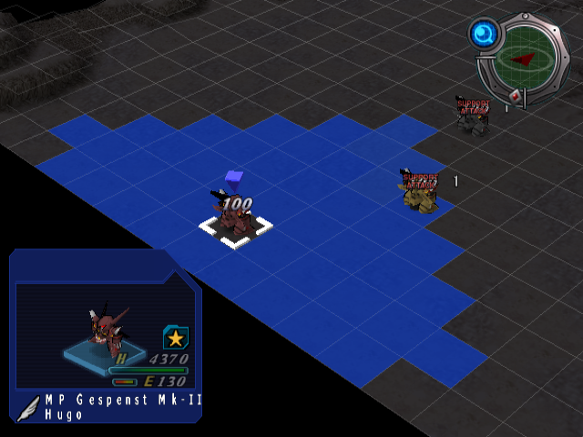
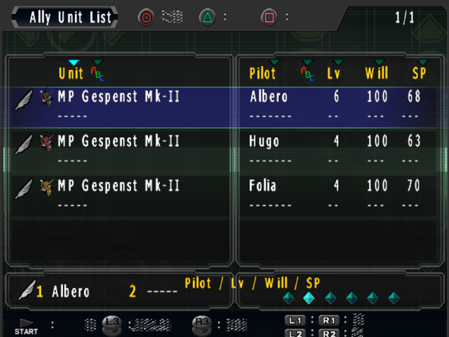
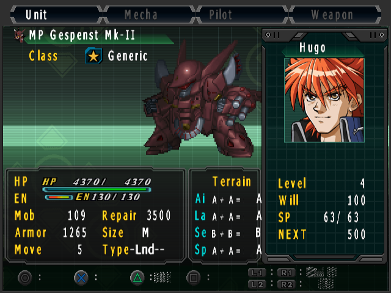
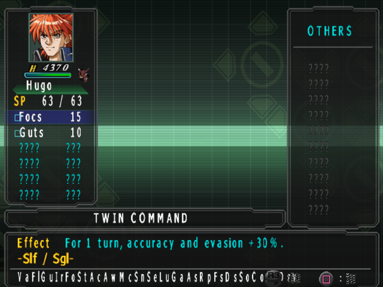
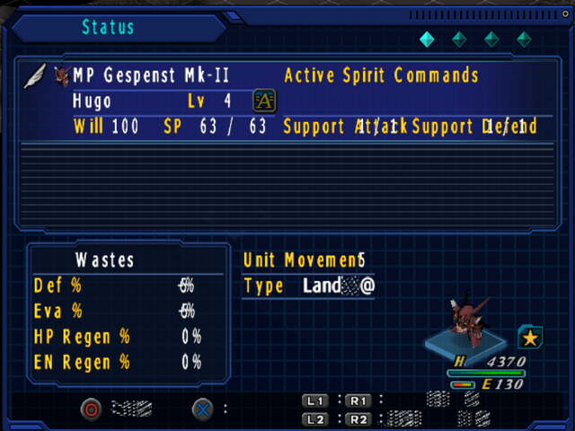
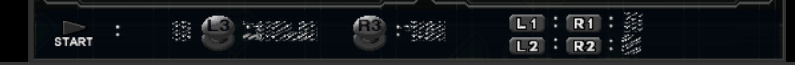
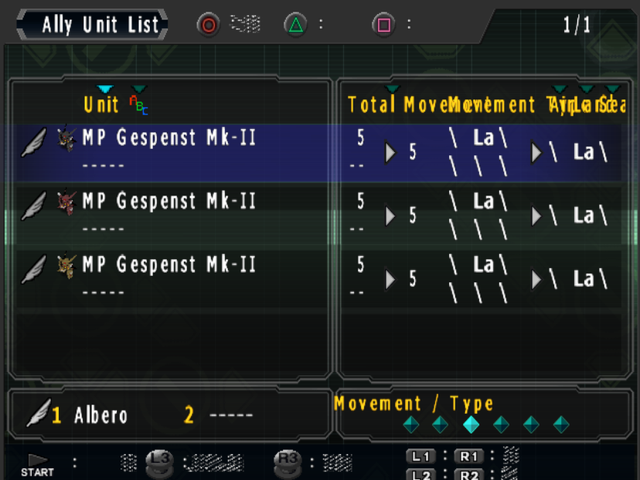

# Super Robot Taisen: Original Generation Gaiden — English Translation Patch

**Version:** 0.2.7 · **Platform:** PlayStation 2 · **Patch format:** xdelta3

This is a fan-made **English translation** of the PlayStation 2 game
*Super Robot Taisen: Original Generation Gaiden* (スーパーロボット大戦OG ジ・インスペクター 外伝 —
JP retail, serial **SLPS-25836**). As far as we can determine (June 2026), no other complete
English translation of this title exists, so this may be the first. (If you find another, great —
please let us know.)

> ## 0.2.7 — Ally Unit List placeholder fix (cumulative)
> **0.2.7 cleans up the Ally Unit List.** For unnamed mass-produced units (like the prologue's
> "MP Gespenst Mk-II"), the sub-pilot line showed `\\\\\` — a placeholder of five full-width minus signs
> that the English font rendered as backslashes. It now reads `-----`, matching the game's own empty-slot
> style. **Note:** this is the first 0.2.x release to edit the boot ELF, so the PCSX2 game CRC changes to
> `6C5AF6E0` and 0.2.6 save states won't load. It builds on **0.2.6** (Spirit target-mode line `−Slf／Sgl−`
> + status-label fit), **0.2.5** (Spirit-menu legend `VaFlGu…SyDrv` + terrain tile names like 荒野 →
> "Wastes"), **0.2.4** (per-unit air/land/water terrain glyphs **Ai/La/Se**), and **0.2.3** (the
> Spirit-menu crash fix), and carries forward everything from 0.2.x: chapter-intro splash screens in
> English, corrected menu/UI spacing, the centered command menu, the full-width objective screen, and the
> long list of status-screen and battle-overlay fixes. The whole game is translated and playable end to
> end.
>
> It's still a young release with a few **known cosmetic rough edges** (see *Known issues* below), and
> there are surely more we haven't caught. **Please report anything you find** →
> [open an issue](https://github.com/camd11/srw-og-gaiden-en/issues). A screenshot + roughly where it
> happened (stage / menu / battle) is incredibly helpful. Bug reports, suggested wording, and general
> feedback are all welcome.

> **You must supply your own legally-dumped copy of the Japanese disc.** This patch contains only the
> *changed bytes* (the translation) — no copyrighted game data. It is useless without the original ISO.

---

## Screenshots

All captured from the final patched ISO on a fresh New Game — no texture pack, everything is baked into
the patch.

| | |
|---|---|
| **Title screen** | **Story dialogue** |
|  |  |
| **In-battle combat animation** | **Tactical map** |
|  |  |
| **Ally Unit List** (sub-line `-----`, new in 0.2.7) | **Unit status screen** |
|  |  |
| **Spirit menu** (target line `-Slf / Sgl-`, legend in English) | **English terrain tile name** |
|  |  |

---

## What's translated

- **Story / event dialogue** — 100% English, in the OG1-English proportional font (Kingcom style:
  speaker name on the line above, no 「」 brackets).
- **System & menu text** — boot/save prompts, the Intermission UI, unit status & ability screens,
  the battle/map overlays (Unit Stats, HP/EN/Will/SP, OFFENSE/DEFENSE/etc.).
- **In-battle text** — pilot battle barks, support-attack/defense cut-in banners
  (SIMULTANEOUS / ASSIST / EXECUTE ATTACK, SHIELD, SUPPORT ATTACK, SUPPORT DEFENSE), HUD badges.
- **Art / logos** — the title logo, the chapter-intro splash cards ("Episode N" + each chapter title),
  intermission/sortie banners, card-mode menus, and assorted menu sprites redrawn in English.
- **Post-game / omake** content.

Goal of the project: **no Japanese left on screen** during normal play.

---

## Requirements — the exact base ISO

The patch applies to **one specific dump** of the Japanese disc. Verify yours matches before patching:

| | |
|---|---|
| File name (any name is fine) | the JP *OG Gaiden* disc image |
| Serial | **SLPS-25836** |
| Size | **4,666,294,272 bytes** |
| MD5 | `cb7dc4485f46f220c46095c966a3aad0` |
| SHA1 | `2891231bc85603d420c35cda55285d5ecb781f1b` |

If your checksums differ you have a different dump; the patch will refuse to apply (xdelta verifies the
source). Re-dump from your own disc with a tool like ImgBurn or a redump-style dumper.

### The patch file

| | |
|---|---|
| File | `SRW_OG_Gaiden_EN_v0_2_7.xdelta` |
| Size | 3,691,830 bytes |
| MD5 | `53d4d43a80f3433a3a51e2521f64d79a` |
| SHA1 | `11c99fb0fc8ea2e885f84ffb8dc370bc945e58a3` |

---

## How to apply the patch

You need **xdelta3** (or a GUI front-end for it).

### Easiest — GUI (Windows): Delta Patcher
1. Download **Delta Patcher** (by Phoenix / "DeltaPatcher").
2. *Original file* → your JP `SLPS-25836` ISO.
3. *XDelta patch* → `SRW_OG_Gaiden_EN_v0_2_7.xdelta`.
4. Click **Apply patch**. It writes a new patched ISO next to the original.

### Command line (Windows / macOS / Linux)
```bash
# from a folder containing both the patch and your JP ISO
xdelta3 -d -s "SLPS-25836 (your JP dump).iso" SRW_OG_Gaiden_EN_v0_2_7.xdelta "OG_Gaiden_EN_v0_2_7.iso"
```
- `-d` = decode/apply, `-s` = source (the original JP ISO).
- Install xdelta3: Windows → download the xdelta3 binary; macOS → `brew install xdelta`;
  Debian/Ubuntu → `sudo apt-get install xdelta3`.

### Verify your result
The patched ISO should match:

| | |
|---|---|
| Size | 4,666,294,272 bytes |
| MD5 | `ffeb49c99405896d2201bd339b5ca941` |
| SHA1 | `a13d1f9dabc583a11f2bd0720fd9a0af926745e4` |

If it matches, the patch applied perfectly.

---

## How to play

- **Emulator (PCSX2):** load the patched ISO. The translation was developed and verified on PCSX2.
  No special settings are required for the text to display in English (it renders straight from the
  disc). The game's CRC after patching is `6C5AF6E0` (changed from 0.2.6's `6C5AA761`, because 0.2.7
  edits the boot ELF — so PCSX2 save states made on 0.2.6 will not load on 0.2.7).
- **Real hardware:** the patched ISO can be burned / loaded via the usual PS2 backup methods. This is
  a same-size, in-place patch, so it behaves like the original disc on real hardware.

---

## Known issues / scope notes

These are minor and cosmetic — normal story + battle play is fully English. Targeted for the next patch:

- The small **footer/header button-hint labels** (the L1/R1/L2/R2, ◎/△ hints on the unit-status/list
  screens) render as a few garbled pixels, and the per-unit **movement-rank** glyphs in the unit-detail
  overlay are similar. Confirmed in 0.2.7: these are drawn through a small UI sprite-font with no Latin
  glyphs (the in-ROM text tables for these labels are dead duplicates; the live source is
  sprite/overlay-internal), so they need font/art work rather than a text edit — planned for a later patch.
  The button *icons* draw correctly; only the little labels beside them are noise:

  

- The unit-list Movement/Type column still shows garbled column headers and single `\` separators, and the
  compact "Active Spirit Commands" status shows a `Type Land` tail with stray pixels — both are the same
  full-width-minus family as the (now-fixed) unit-list placeholder and are on the to-do list. (The `La` =
  Land values themselves are correct.)

  
- The last two Spirit-legend entries (Sy / Drv) slightly graze the R3 button-hint icon.
- If you import a **save file made on the original Japanese game** (or a suspend save from an older
  patch build) mid-battle, some objective text baked into that save can show Japanese. Start a
  **New Game** on the patched ISO for the fully-English experience.

Fixed since 0.2: the Ally Unit List placeholder reads `-----` instead of `\\\\\` (0.2.7), the Spirit
target-mode line now reads English (−Slf／Sgl−) and the over-wide status
labels no longer overlap their values (0.2.6), the Spirit-panel bottom legend reads English and the
terrain tile names are English (0.2.5), the per-unit terrain glyphs read Ai/La/Se (0.2.4), the
Spirit-menu crash (0.2.3), the command-menu centering (0.2.2), the full-width objective screen and
splash-title rendering and battle command-menu label fit (0.2.1). See `CHANGELOG.md`.

---

## Reporting issues & feedback

Your playtesting directly shapes the next release. If you hit anything off:

- **Open an issue:** https://github.com/camd11/srw-og-gaiden-en/issues
- Include, if you can: a **screenshot**, **where** it happened (stage / menu / battle screen), and
  whether you were on a **New Game** or an imported save.
- Typos, awkward phrasing, text that runs off the box, untranslated bits, crashes, suggested better
  wording — all of it is welcome.

Fixes will be rolled into the next patch version.

---

## Credits

- **Translation, romhacking, art, testing:** Creamhouse.
- **Built with:** Claude (Anthropic) for reverse-engineering, translation, and tooling; Codex for the
  pixel-art edits.
- **Terminology authority:** Kingcom's English patch of *OG: Original Generations* — the canonical
  English glossary for Original Generation terms, names, and attack names. This project follows it
  wherever the two games overlap.
- Tools in the xdelta / armips lineage made the reinsertion possible.

This is a non-commercial fan project, made for preservation and to let English speakers enjoy a game
that was never localized. **Do not sell this patch or patched discs.** All trademarks and copyrights
belong to their respective owners (Banpresto / Bandai Namco). Distribute the **patch only** — never the
patched ISO or any copyrighted game data.
