# Super Robot Taisen: Original Generation Gaiden — English Translation Patch

**Version:** 0.2.9 · **Platform:** PlayStation 2 · **Patch format:** xdelta3

This is a fan-made **English translation** of the PlayStation 2 game
*Super Robot Taisen: Original Generation Gaiden* (スーパーロボット大戦OG ジ・インスペクター 外伝 —
JP retail, serial **SLPS-25836**). As far as we can determine (June 2026), no other complete
English translation of this title exists, so this may be the first. (If you find another, great —
please let us know.)

> ## 0.2.9 — community bug round: backlog crash, banners, VN renderer (cumulative)
> **0.2.9 fixes the bugs reported by the community on 0.2.8** — thank you Soulgaijin,
> JorgeMario-V, coconono, and riohcx for the reports. The headline fixes:
> **the backlog (△) crash is fixed** (opening the backlog during certain dialogues froze the
> game; the same fix ends the backlog's repeated sentences and the vanishing speaker sprite);
> the **Skill Point banner**, **story-recap scroll**, **CONTINUE-screen banner**, and
> **Parts menu descriptions** all render correctly; and the **VN-scene location banners**
> (`Transport - Hangar` etc.) no longer garble — that one was a bug in the game's banner
> renderer itself, patched in the boot ELF without touching any dialogue path.
> **Note:** the ELF edit changes the PCSX2 game CRC to **`DF47D8DA`** — save *states* from
> 0.2.8 won't load; memory-card *saves* carry over fine. Everything from 0.2 – 0.2.8 is
> included; the whole game is translated and playable end to end.
>
> **Playing on real hardware via OPL?** The Stage-2 scrolling-intro freeze
> ([issue #1](https://github.com/camd11/srw-og-gaiden-en/issues/1)) is **not** claimed fixed in
> 0.2.9 — it only reproduces on hardware, which we can't test. A candidate fix is posted on the
> issue as a separate opt-in test patch; if you can test it, please report back.
>
> It's still a young release with a few **known cosmetic rough edges** (see *Known issues* below), and
> there are surely more we haven't caught. **Please report anything you find** →
> [open an issue](https://github.com/camd11/srw-og-gaiden-en/issues). A screenshot + roughly where it
> happened (stage / menu / battle) is incredibly helpful. Bug reports, suggested wording, and general
> feedback are all welcome.

> **You must supply your own legally-dumped copy of the Japanese disc.** This patch contains only the
> *changed bytes* (the translation) — no copyrighted game data. It is useless without the original ISO.

---

## Screenshots

All captured from the final patched ISO on a fresh New Game — no texture pack, everything is baked into
the patch.

| | |
|---|---|
| **Skill Point banner** (fixed in 0.2.9) | **Story-recap scroll** (on-screen, fixed in 0.2.9) |
| 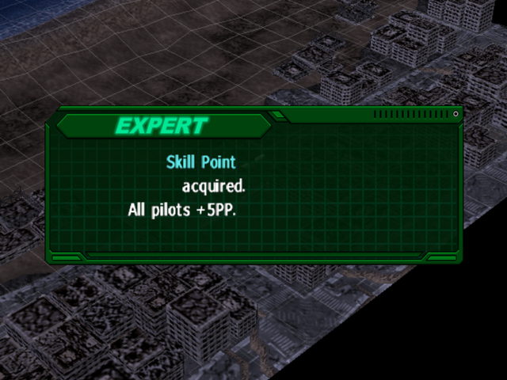 | 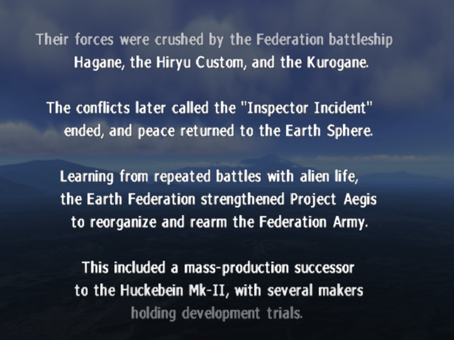 |
| **VN location banner** (fixed in 0.2.9) | **Parts descriptions** (fixed in 0.2.9) |
| 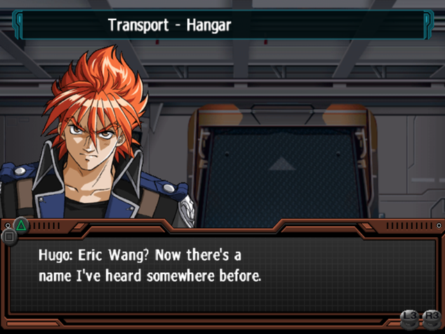 | 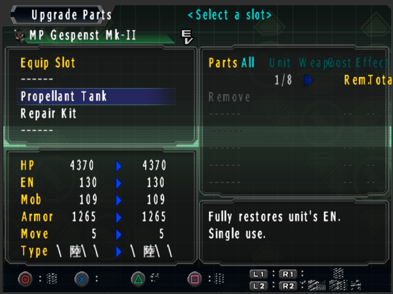 |
| **Episode splash** | **CONTINUE banner** (fixed in 0.2.9) |
| 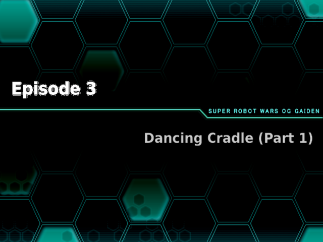 | 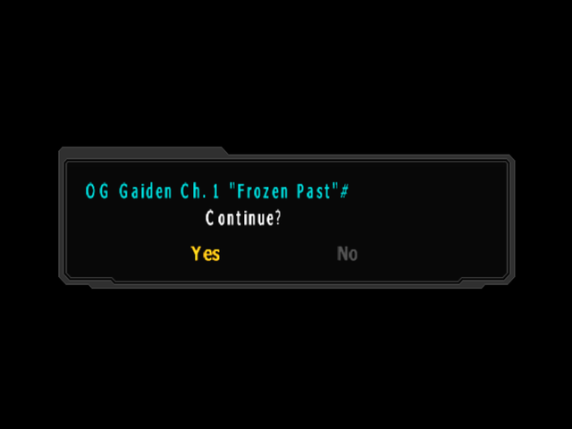 |
| **Story dialogue** (inline names + 3 rows) | **Backlog** (crash fixed in 0.2.9) |
| 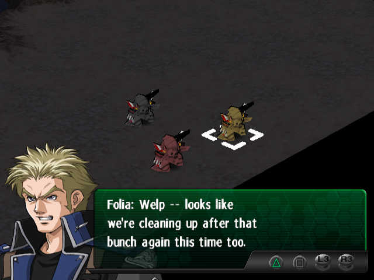 | 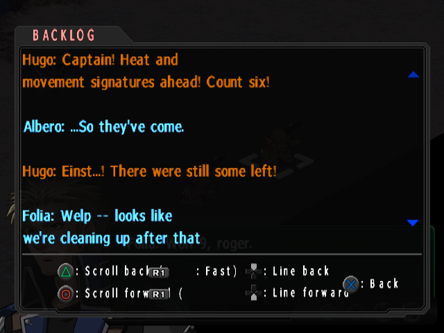 |
| **Title screen** | **In-battle combat animation** |
| 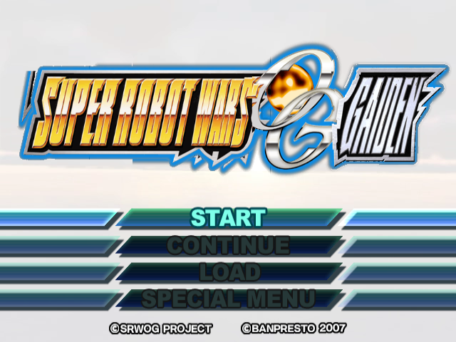 | 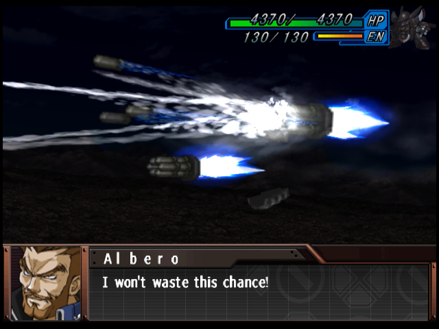 |
| **BGM Select** | **Save slots** |
| 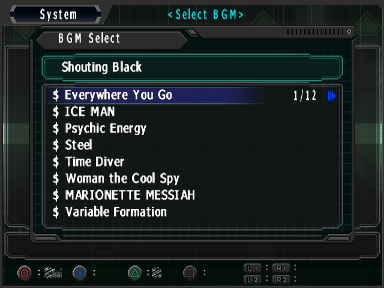 | 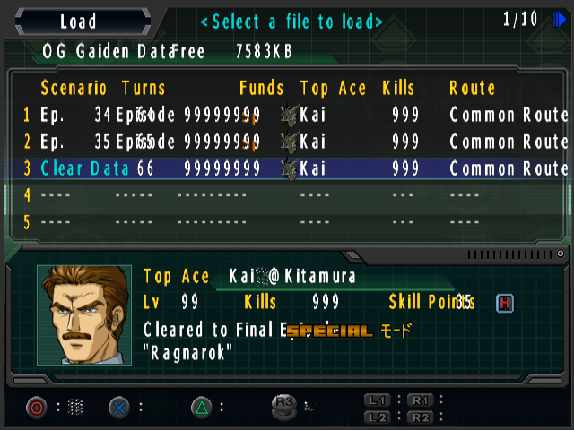 |

---

## What's translated

- **Story / event dialogue** — 100% English, in the OG1-English proportional font (Kingcom style:
  inline `Name: dialogue` speaker names, no 「」 brackets).
- **System & menu text** — boot/save prompts, the Intermission UI, unit status & ability screens,
  the battle/map overlays (Unit Stats, HP/EN/Will/SP, OFFENSE/DEFENSE/etc.).
- **In-battle text** — pilot battle barks, support-attack/defense cut-in banners
  (SIMULTANEOUS / ASSIST / EXECUTE ATTACK, SHIELD, SUPPORT ATTACK, SUPPORT DEFENSE), HUD badges.
- **Art / logos** — the title logo, the chapter-intro splash cards ("Episode N" + each chapter title),
  intermission/sortie banners, card-mode menus, and assorted menu sprites redrawn in English.
- **Post-game / omake** content.

Goal of the project: **no Japanese left on screen** during normal play.

---

## Requirements — the exact base ISO

The patch applies to **one specific dump** of the Japanese disc. Verify yours matches before patching:

| | |
|---|---|
| File name (any name is fine) | the JP *OG Gaiden* disc image |
| Serial | **SLPS-25836** |
| Size | **4,666,294,272 bytes** |
| MD5 | `cb7dc4485f46f220c46095c966a3aad0` |
| SHA1 | `2891231bc85603d420c35cda55285d5ecb781f1b` |

If your checksums differ you have a different dump; the patch will refuse to apply (xdelta verifies the
source). Re-dump from your own disc with a tool like ImgBurn or a redump-style dumper.

### The patch file

| | |
|---|---|
| File | `SRW_OG_Gaiden_EN_v0_2_9.xdelta` |
| Size | 4,055,210 bytes |
| MD5 | `852a28d09f902e670363c1dbfc08b7ec` |
| SHA1 | `1847db13049e80f4e4a2cc4192434fda8c9c7e2b` |

---

## How to apply the patch

You need **xdelta3** (or a GUI front-end for it).

### Easiest — GUI (Windows): Delta Patcher
1. Download **Delta Patcher** (by Phoenix / "DeltaPatcher").
2. *Original file* → your JP `SLPS-25836` ISO.
3. *XDelta patch* → `SRW_OG_Gaiden_EN_v0_2_9.xdelta`.
4. Click **Apply patch**. It writes a new patched ISO next to the original.

### Command line (Windows / macOS / Linux)
```bash
# from a folder containing both the patch and your JP ISO
xdelta3 -d -s "SLPS-25836 (your JP dump).iso" SRW_OG_Gaiden_EN_v0_2_9.xdelta "OG_Gaiden_EN_v0_2_9.iso"
```
- `-d` = decode/apply, `-s` = source (the original JP ISO).
- Install xdelta3: Windows → download the xdelta3 binary; macOS → `brew install xdelta`;
  Debian/Ubuntu → `sudo apt-get install xdelta3`.

### Verify your result
The patched ISO should match:

| | |
|---|---|
| Size | 4,666,294,272 bytes |
| MD5 | `de91ab6da80135e932a7c58d8dec8271` |
| SHA1 | `85a0d82648e126cd3bbccc7de2df96b2baab2f87` |

If it matches, the patch applied perfectly.

---

## How to play

- **Emulator (PCSX2):** load the patched ISO. The translation was developed and verified on PCSX2.
  No special settings are required for the text to display in English (it renders straight from the
  disc). The game's CRC after patching is `DF47D8DA` (changed from 0.2.8's `1F76B2D9`, because 0.2.9
  patches the banner renderer in the boot ELF — so PCSX2 save states made on 0.2.8 will not load on
  0.2.9; memory-card saves carry over fine).
- **Real hardware:** the patched ISO can be burned / loaded via the usual PS2 backup methods. This is
  a same-size, in-place patch, so it behaves like the original disc on real hardware. **Known issue:**
  via OPL, a freeze at the Stage-2 scrolling intro has been reported
  ([issue #1](https://github.com/camd11/srw-og-gaiden-en/issues/1)); a candidate fix is posted there
  as a separate opt-in test patch — hardware testers very welcome.

---

## Known issues / scope notes

Normal story + battle play is fully English.

- **Stage-2 scrolling-intro freeze on real hardware via OPL**
  ([issue #1](https://github.com/camd11/srw-og-gaiden-en/issues/1)) — hardware-only; cannot be
  reproduced in an emulator. A candidate fix (relocates the intro's event data on the disc, zero
  script changes) is posted on the issue as an opt-in test patch. **If you play via OPL, please
  test it and report back** — once confirmed it folds into the next general release.
- **Arado's battle quotes intermittently blank or garbled**
  ([issue #4](https://github.com/camd11/srw-og-gaiden-en/issues/4)) — under investigation for the
  next patch. Reports of *which* map/opponent it happens on are very helpful.
- The small **footer/header button-hint labels** (the L1/R1/L2/R2, ◎/△ hints on the unit-status/list
  screens) render as a few garbled pixels, and the per-unit **movement-rank** glyphs in the unit-detail
  overlay are similar. These are drawn through a small UI sprite-font with no Latin glyphs, so they need
  font/art-cell work rather than a text edit — the investigation is well advanced and it's planned for
  a later patch. The button *icons* draw correctly; only the little labels beside them are noise:

  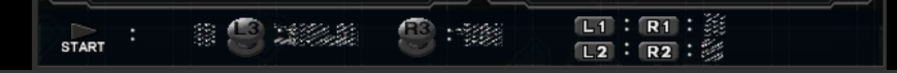

- **Very long backlog rows truncate**: a handful of extremely long dialogue lines get their tail cut
  in the backlog view (the dialogue box itself is always complete). This is the safety net of the
  0.2.9 crash fix — a clean truncation instead of the old crash/garbage. Cosmetic.
- The **CONTINUE dialog** shows a small stray `#` after the episode title (a template control code;
  it appears in the original bug report too). Cosmetic.
- A **second copy of the BGM list** used by the intermission Sound menu still has the old blank-row
  issue. The same fix as BGM Select is prepared; it ships once verified on that screen.
- **Save files written by 0.2.7 or older** show a garbled title in the save slot list.
  This is baked into the old save data itself — re-saving once on 0.2.8+ rewrites it clean. Similarly,
  save files imported from the original JP game can show baked-in Japanese objective text mid-battle;
  start a New Game for the fully-English experience.
- The last two Spirit-legend entries (Sy / Drv) slightly graze the R3 button-hint icon.
- The **NTSC-J Limited Edition disc** (different serial/master) is not supported by this patch
  ([issue #9](https://github.com/camd11/srw-og-gaiden-en/issues/9)) — it's a different dump, so the
  xdelta refuses it. Use the standard retail dump (SLPS-25836).

Fixed since 0.2: the backlog crash/repeats/sprite-vanish, the Skill Point banner, the story-recap
scroll, the CONTINUE banner, the Parts descriptions, and the VN location-banner renderer (0.2.9);
the OPL real-hardware boot crash, the blank Save/Load slot list, the blank BGM Select
list, script-wide dialogue re-layout ending all box cut-offs and backlog double-draws, and the
Movement/Type page garble (0.2.8); the Ally Unit List placeholder reads `-----` instead of `\\\\\`
(0.2.7), the Spirit target-mode line now reads English (−Slf／Sgl−) and the over-wide status
labels no longer overlap their values (0.2.6), the Spirit-panel bottom legend reads English and the
terrain tile names are English (0.2.5), the per-unit terrain glyphs read Ai/La/Se (0.2.4), the
Spirit-menu crash (0.2.3), the command-menu centering (0.2.2), the full-width objective screen and
splash-title rendering and battle command-menu label fit (0.2.1). See `CHANGELOG.md`.

---

## Reporting issues & feedback

Your playtesting directly shapes the next release. If you hit anything off:

- **Open an issue:** https://github.com/camd11/srw-og-gaiden-en/issues
- Include, if you can: a **screenshot**, **where** it happened (stage / menu / battle screen), and
  whether you were on a **New Game** or an imported save.
- Typos, awkward phrasing, text that runs off the box, untranslated bits, crashes, suggested better
  wording — all of it is welcome.

Fixes will be rolled into the next patch version.

---

## Credits

- **Translation, romhacking, art, testing:** Creamhouse.
- **Built with:** Claude (Anthropic) for reverse-engineering, translation, and tooling; Codex for the
  pixel-art edits.
- **Terminology authority:** Kingcom's English patch of *OG: Original Generations* — the canonical
  English glossary for Original Generation terms, names, and attack names. This project follows it
  wherever the two games overlap.
- Tools in the xdelta / armips lineage made the reinsertion possible.

This is a non-commercial fan project, made for preservation and to let English speakers enjoy a game
that was never localized. **Do not sell this patch or patched discs.** All trademarks and copyrights
belong to their respective owners (Banpresto / Bandai Namco). Distribute the **patch only** — never the
patched ISO or any copyrighted game data.
